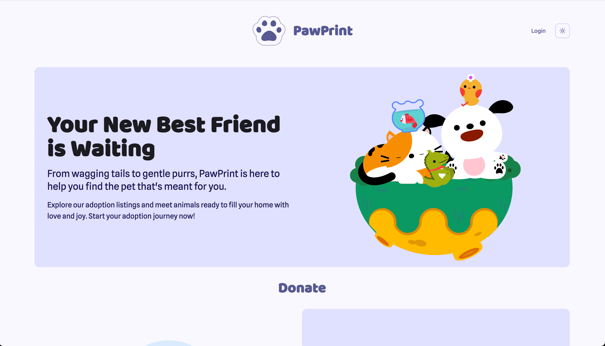
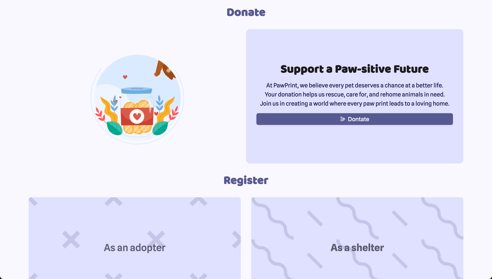
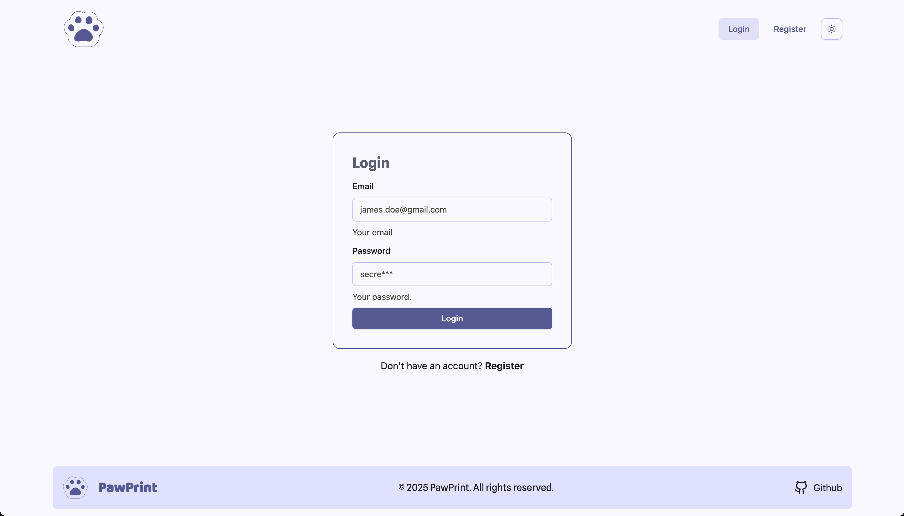
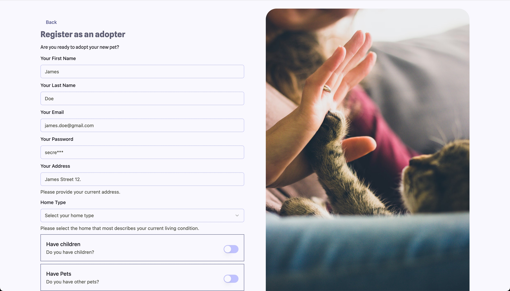
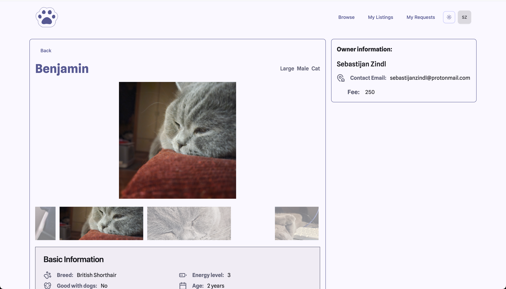
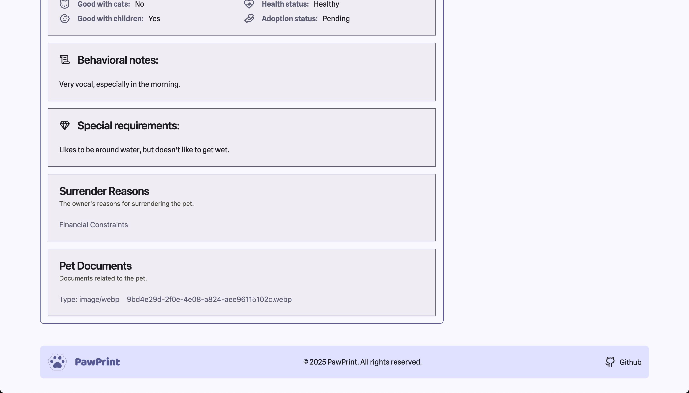
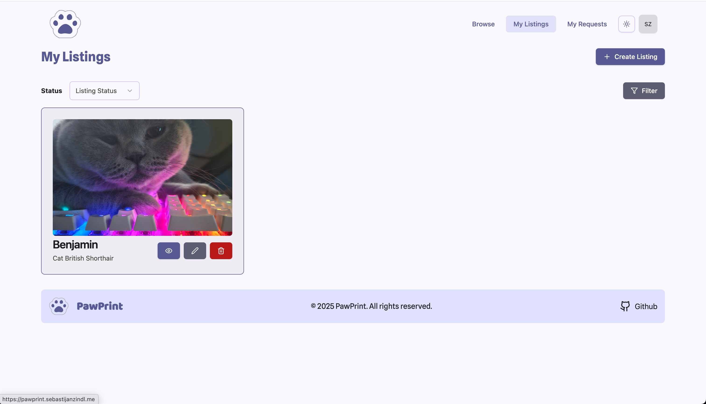
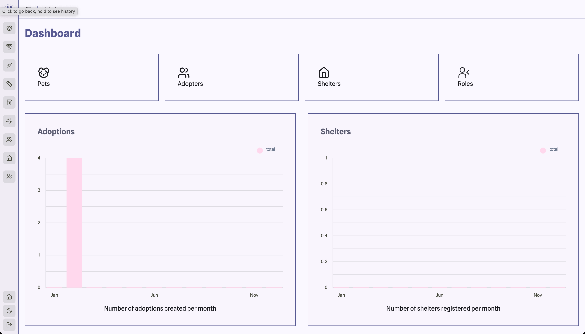

# Paw Print

## About the Project
PawPrint is an innovative pet adoption platform designed to connect shelters, rescue organizations, 
and potential adopters in a seamless and user-friendly way. 
Our mission is to reduce the number of homeless pets by making adoption easier, more accessible, 
and more appealing than buying pets.

With its intuitive and visually appealing user interface, 
this project aims to empower shelters and individuals to list pets available for adoption, 
complete with detailed profiles, photos, and adoption requirements. Users can easily search, 
filter, and connect with pets that match their preferences, lifestyle, and location.

## Database & Entities 
<iframe width="560" height="315" src='https://dbdiagram.io/e/67601dcce763df1f0013e550/67ae1157263d6cf9a0127b58'> </iframe>

## Features
- Browsing and filtering available listings from both shelters and users.
- Creation of listings both as a Adopter (User) or as a Shelter.
- Customizing the user's preferences based on their preferred pet sizes, types and genders.
- Recommending users current available listings based on their preferences
- As a owner of a listing the ability to update the current adoption process with counselor notes, the adoption status as well as dates to tell the candidate what he can expect
- Email notifications for crucial actions throught the adoption process, such as: new candidates on your listing, new information for your current request on a listing, registration etc... 
- An intuitive admin panel for those hosting to offer the ability to add new pet sizes, types, genders as well as health statuses and adoption statuses.
- The ability to change the roles of user's
- User authentication & authorization using Json Web Tokens.
- Swagger & API documentation for all the controllers
- Stripe integration for donations.
## Screenshots

## License

This project under a [MIT License](LICENSE).

## Roadmap
- A detailed shelter page to view all the current shelter's listings. 
- An option for a shelter to add donations to their page to support their commitment to the mission. 
- An option to export the data of your listings to a supported format (CSV or Excel)
- Mobile friendly website.

## Authors

This project has been made by Sebastijan Zindl, Marko Ilievski and Sara Apostolovska. 

## Related Projects
- [Frontend](https://github.com/m1thrandir225/pawprint-frontend)

## How to run locally
Requirements:
 - .NET 8
 - Resend (for mail integration)
 - Stripe 

To set up the project we recommend using Rider.

Before running the project please setup a `.env` file in the Web project with all the required fields based on the current
`.env.example` file 
